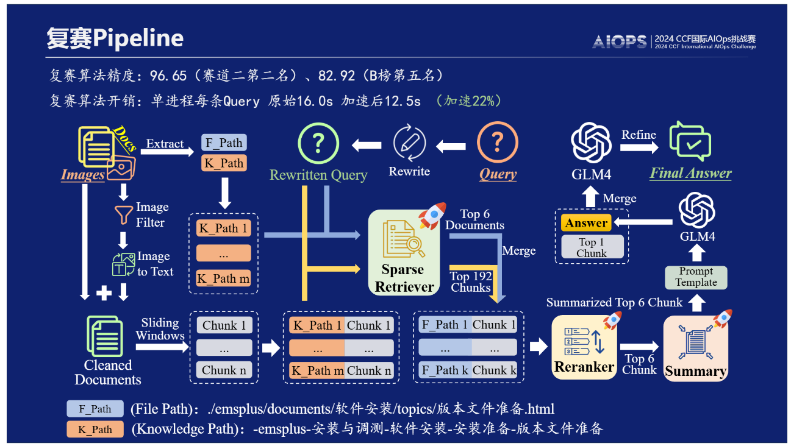

# 2024CCF AIOPs Challenge

# 概述
在不微調的任何模型的情況下，實踐較為簡潔的 RAG，盡可能達到準確高效能和實用。而為了達成目的，作者基於 llama-index 實現了一套包含：**查詢改寫、圖像數據處理、分塊策略、元數據利用、密集查詢、稀疏檢索、重排、排序融合、提示詞優化、上下文壓縮、部屬**的一個框架。

## 第一階段流程

## 第二階段流程

# 準確性

# 高效性

# 實用性