# 一個博士生接受怎樣的訓練是完整、全面的科研訓練？

## Abstract

其實博士生的經典開局，通常是由導師提供一個模糊的課題的開始。所以借著這個問題，和大家分享一下：導師給出一個模糊的課題，博士生應該做些什麼來探索課題，尋找切入點，最終完成課題？先來一張圖劃重點：
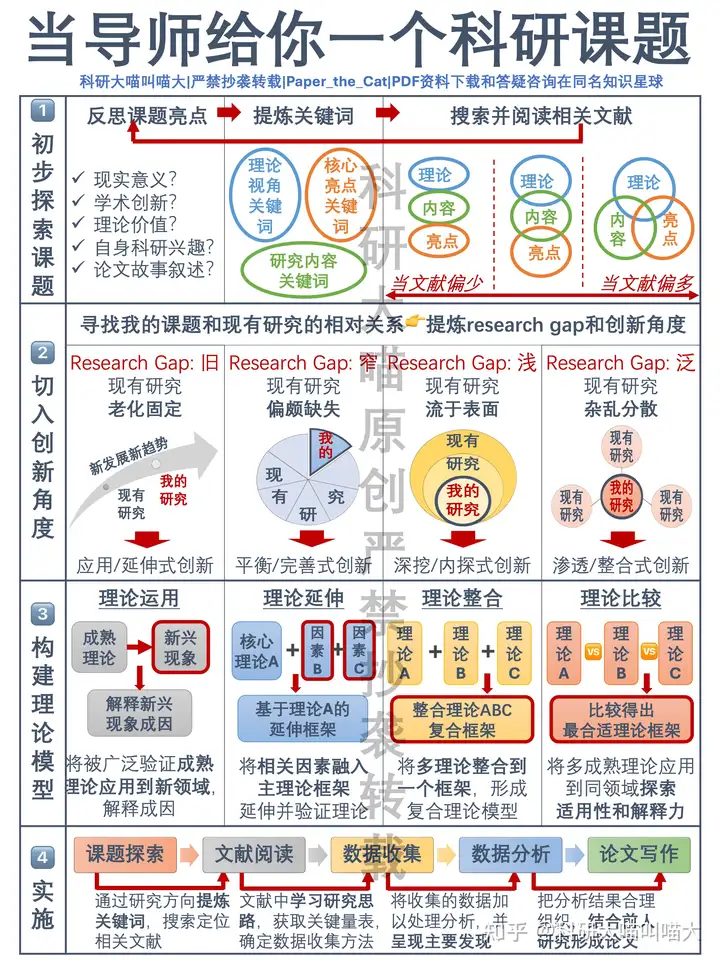

---
## 1. 初步探索課題
課題探索的過程通常是通過文獻閱讀完成的，包括：反思課題亮點，提煉關鍵詞，閱讀相關文獻；但這個過程不是一蹴而就的，而是反反復復，螺旋式前進的。比如通過閱讀文獻可能會理解到課題存在的新亮點，從而重新提煉課題關鍵詞，開啟新一輪的文獻閱讀和課題反思。
這個過程涉及很多問題，包括：
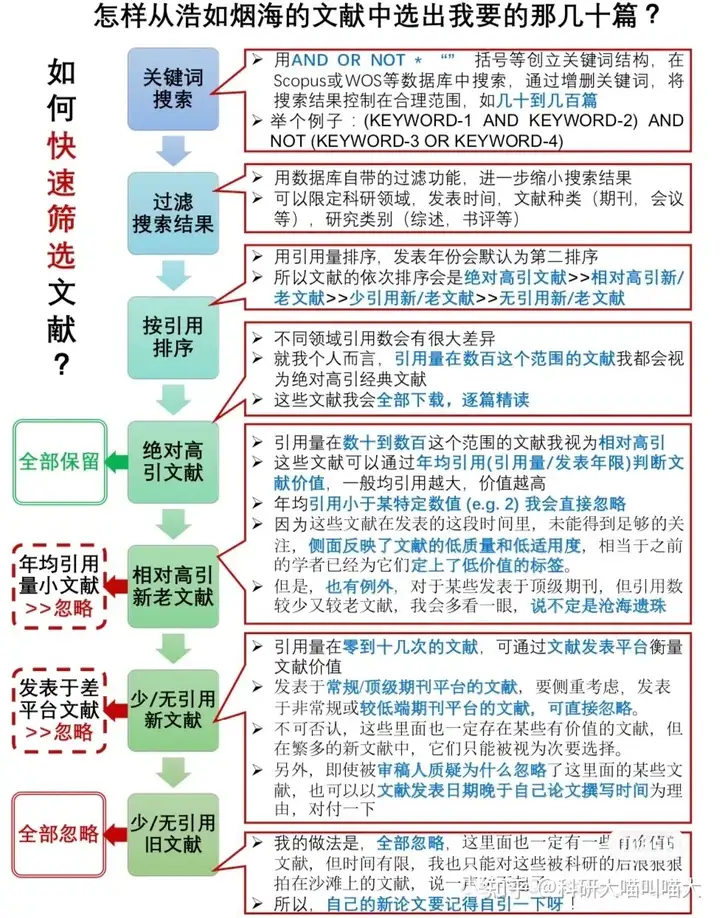
- 1a. 怎麼多角探索並完善課題？
- 1b. 參考文獻有哪些來源和不同用途？
- 1c. 怎麼搜索相關文獻？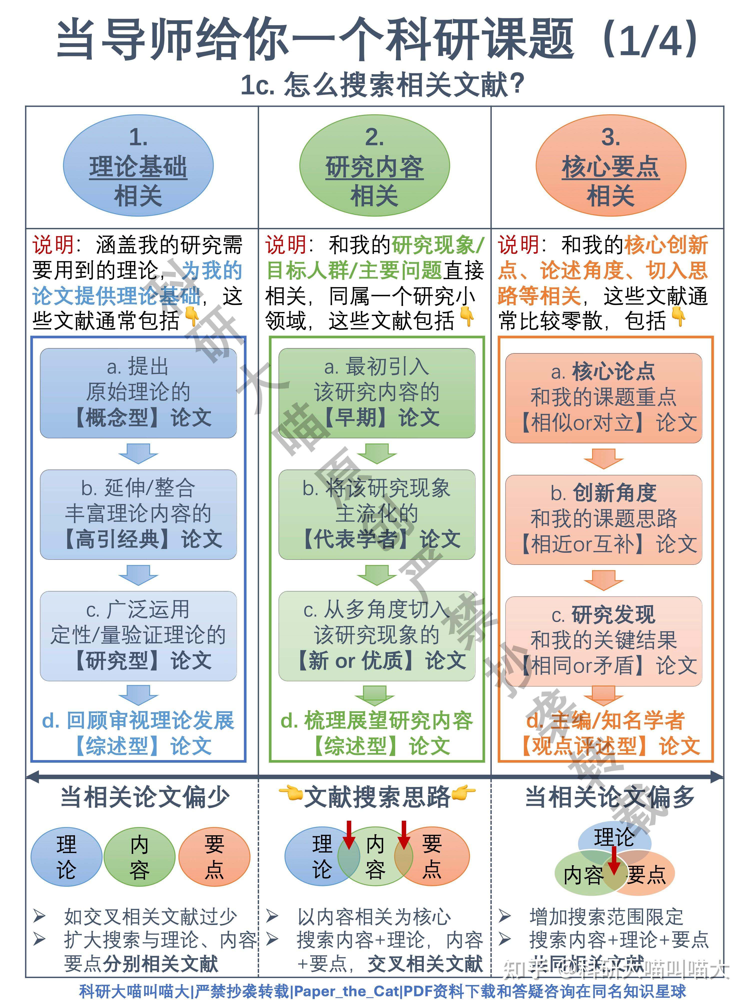
- 1d. 怎麼閱讀並整理相關文獻？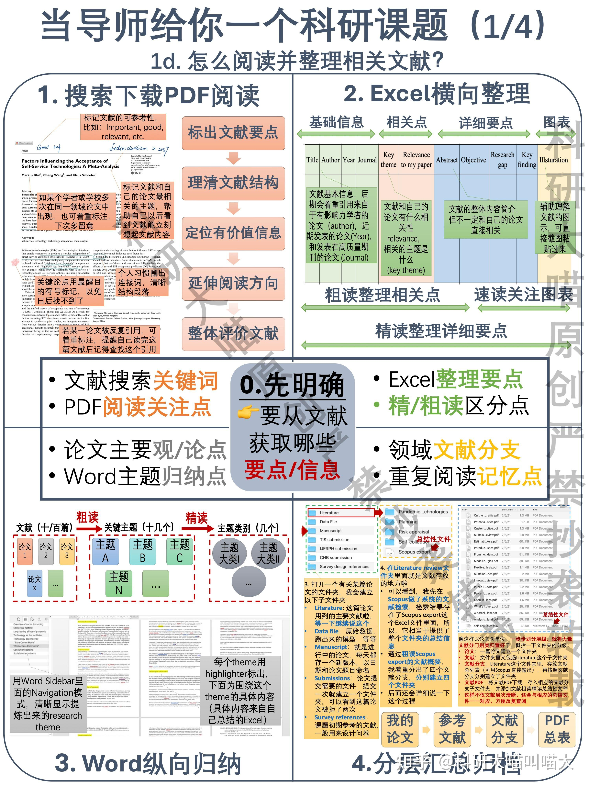
- 1e. 怎麼徹底消化吸收重要文獻？
- 1f. 文獻閱讀的邊界在哪裡？什麼時候該停下來？
- 1g. 怎麼動態構建屬於自己的文獻書架？

---
## 2. 切入創新角度

課題領域通常比較大，我們需要發現一個合適的角度，從這個角度切入，使我的課題和現有文獻呈現出最合理的相對關系，凸顯課題的創新價值。具體來說，這個過程可能涉及到： 

- 2a. 提煉research gap和創新點流程是怎樣的？
- 2b. 怎麼從文獻中提出Research gap？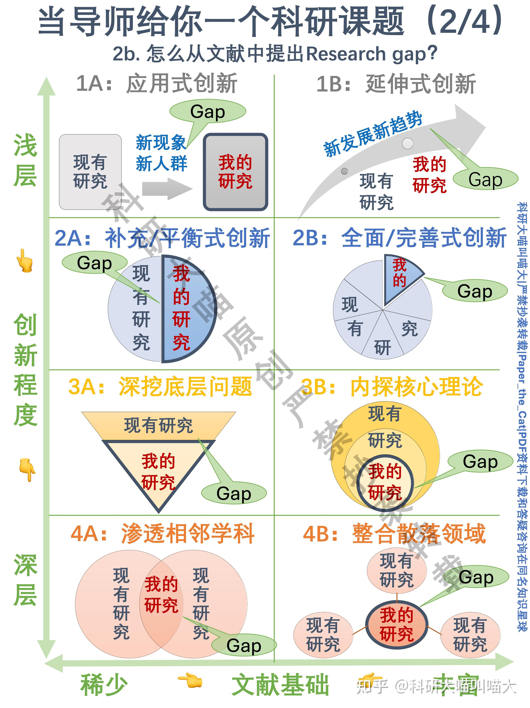
- 2c. 怎麼從research gap提出創新點？
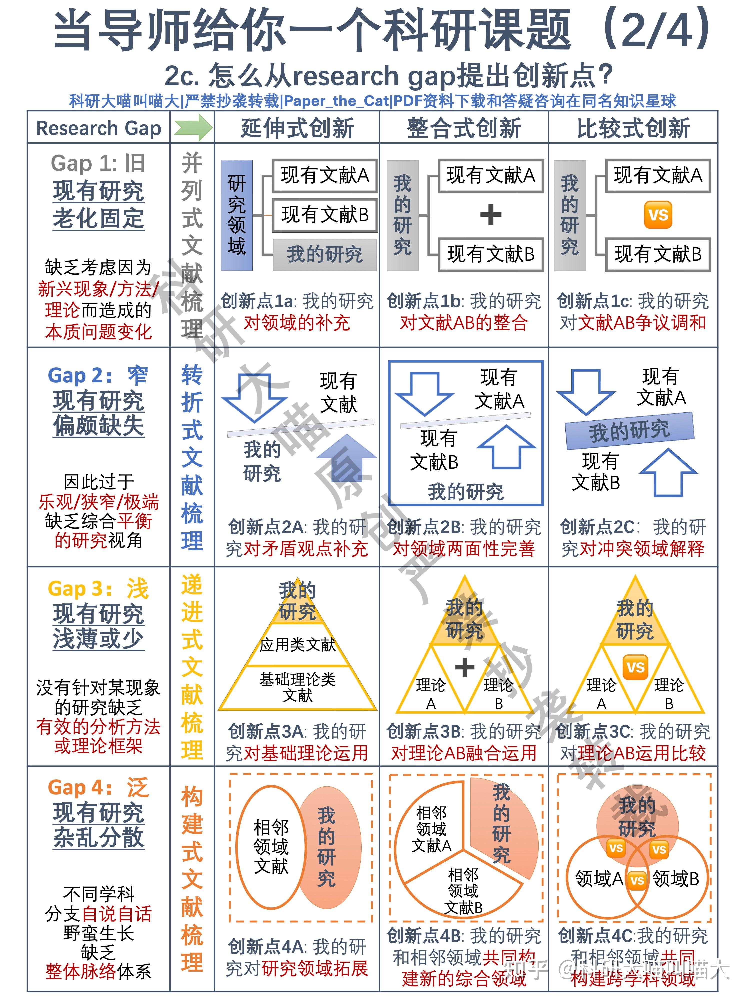
- 2d. 怎麼合理選取文獻平衡呈現課題價值？
- 2e. 怎麼選取文獻烘托research gap和創新點？

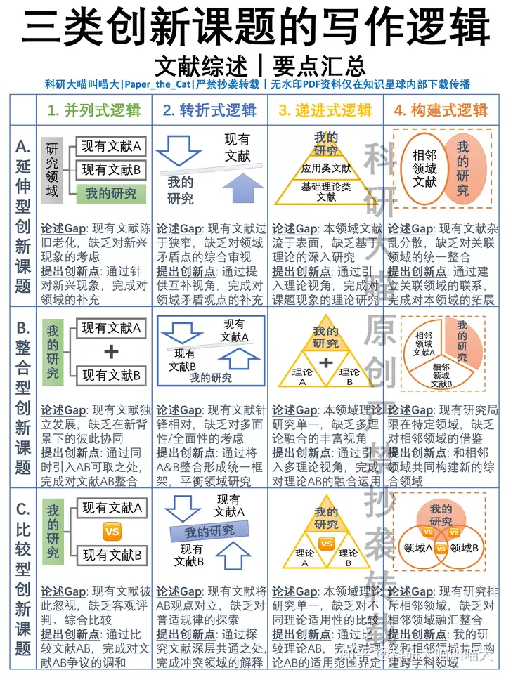
**A. 延伸型创新课题**
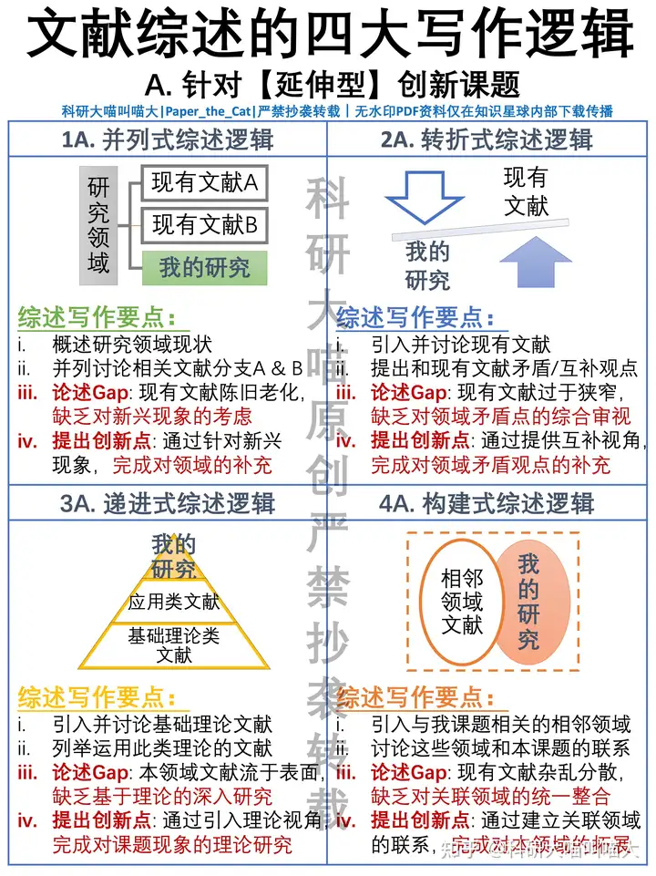
- 并列式创新点呈现逻辑：
  1. 概述研究领域现状
  2. 并列讨论相关文献分支A & B
  3. 论述Gap: 现有文献陈旧老化，缺乏对新兴现象的考虑
  4. 提出创新点: 通过针对新兴现象，完成对领域的补充
- 转折式创新点呈现逻辑：
    1. 引入并讨论现有文献
    2. 提出和现有文献矛盾/互补观点
    3. 论述Gap: 现有文献过于狭窄，缺乏对领域矛盾点的综合审视
    4. 提出创新点: 通过提供互补视角，完成对领域矛盾观点的补充
- 递进式创新点呈现逻辑：
    1. 引入并讨论基础理论文献
    2. 列举运用此类理论的文献
    3. 论述Gap: 本领域文献流于表面，缺乏基于理论的深入研究
    4. 提出创新点: 通过引入理论视角，完成对课题现象的理论研究
- 构建式创新点呈现逻辑：
    1. 引入与我课题相关的相邻领域
    2. 讨论这些领域和本课题的联系
    3. 论述Gap: 现有文献杂乱分散，缺乏对关联领域的统一整合
    4. 提出创新点: 通过建立关联领域的联系，完成对本领域的拓展

**B. 整合型创新课题**
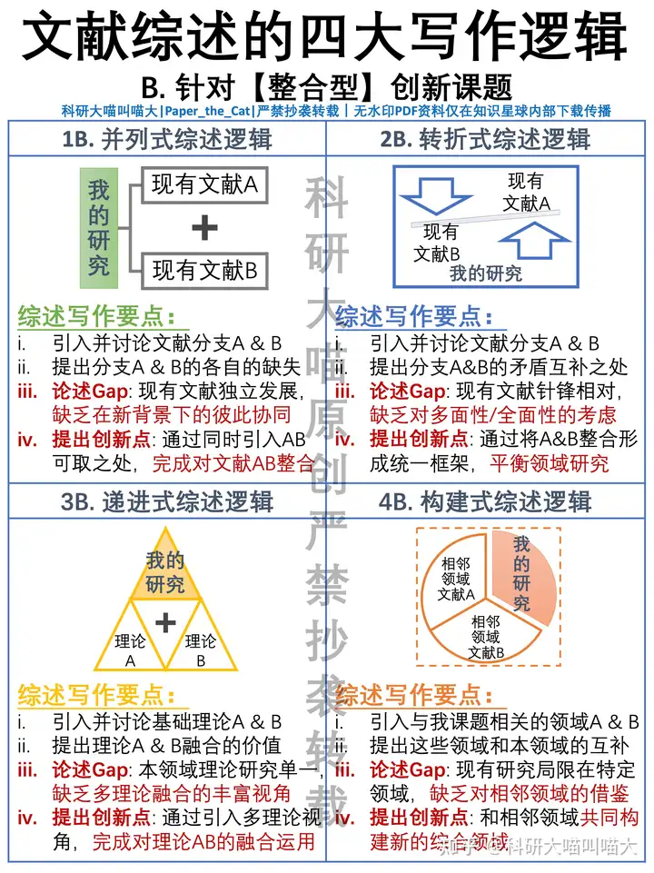
- 并列式创新点呈现逻辑：
  1. 引入并讨论文献分支A & B
  2. 提出分支A & B的各自的缺失
  3. 论述Gap: 现有文献独立发展，缺乏在新背景下的彼此协同
  4. 提出创新点: 通过同时引入AB可取之处，完成对文献AB整合
- 转折式创新点呈现逻辑：
    1. 引入并讨论文献分支A & B
    2. 提出分支A&B的矛盾互补之处
    3. 论述Gap: 现有文献针锋相对，缺乏对多面性/全面性的考虑
    4. 提出创新点: 通过将A&B整合形成统一框架，平衡领域研究
- 递进式创新点呈现逻辑：
    1. 引入并讨论基础理论A & B
    2. 提出理论A & B融合的价值
    3. 论述Gap: 本领域理论研究单一，缺乏多理论融合的丰富视角
    4. 提出创新点: 通过引入多理论视角，完成对理论AB的融合运用
- 构建式创新点呈现逻辑：
    1. 引入与我课题相关的领域A & B
    2. 提出这些领域和本领域的互补
    3. 论述Gap: 现有研究局限在特定领域，缺乏对相邻领域的借鉴
    4. 提出创新点: 和相邻领域共同构建新的综合领域
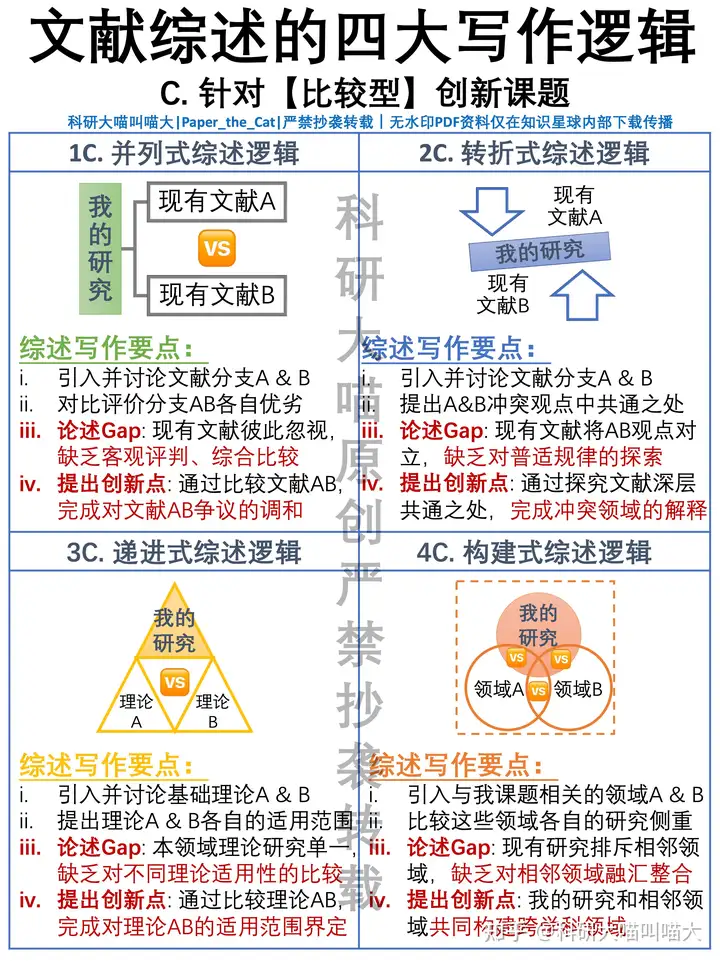

---
## 3. 構建理論模型
構建理論模型的思路不同領域差異很大，這裡就不展開說了，通常涉及到的問題包括：

- 3a. 理論模型有哪些創新角度？
- 3b. 怎麼從不同角度結合理論來設計課題？
- 3c. 怎麼構建理論模型？
- 3d. 怎麼讓枯燥的模型豐富起來？
- 3e. 怎麼分析理論結構模型？
- 3f. 理論結構模型的分析重點在哪裡？

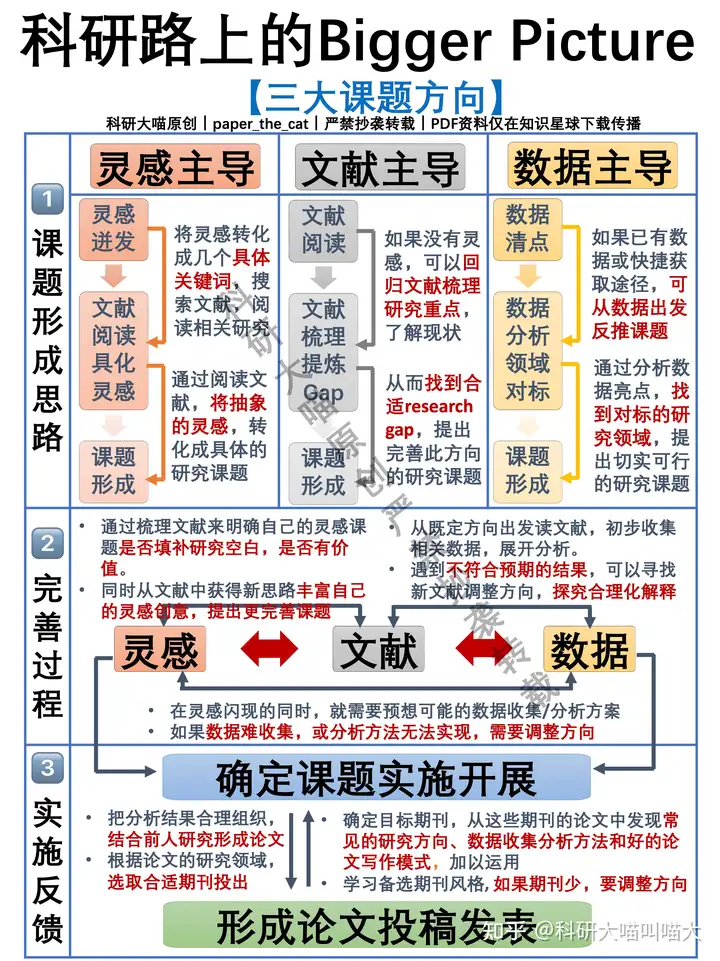
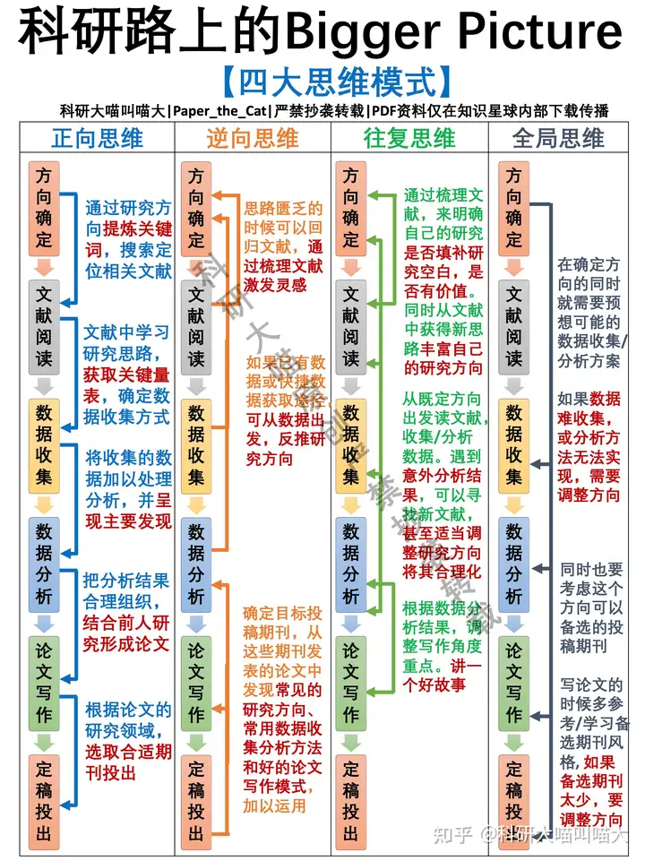
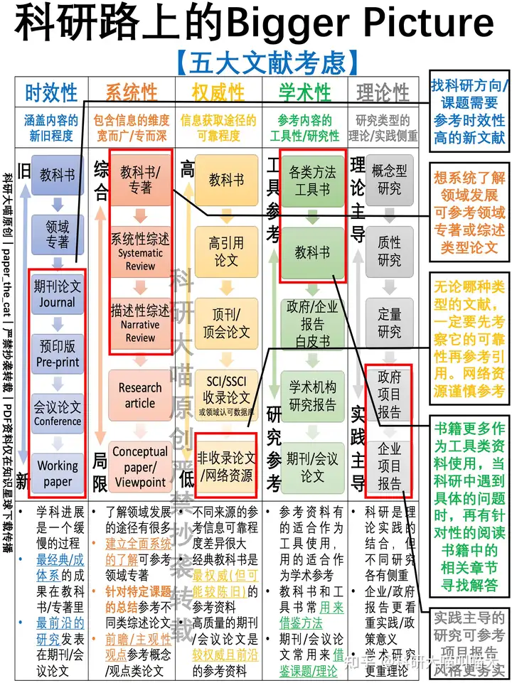
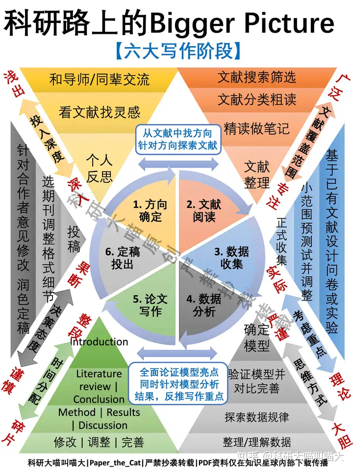
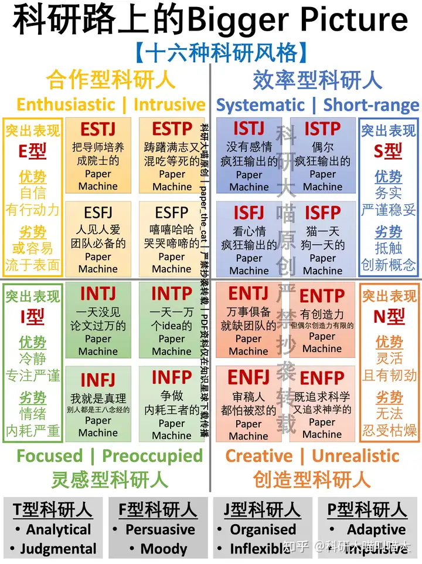
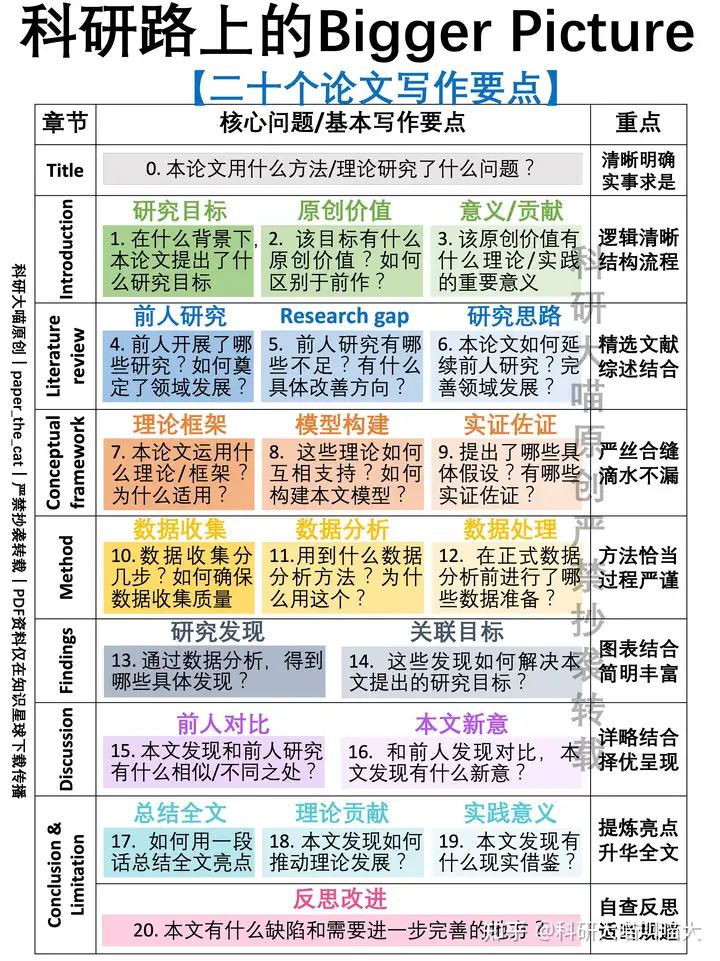

---
## 4. 整體實施完成
這個過程通常需要把課題探索、文獻閱讀、數據收集、數據分析到論文寫作這些不同階段連貫起來執行。當然，一定有同學要說科研不等於寫論文，論文寫作投稿也不是課題的重點，但是現實情況就是，對於大多數博士生來說，寫完論文並發表就是課題最好的收尾。這個過程通常涉及的問題包括：

- 4a. 有哪些高效的科研模式？
- 4b. 有哪些常見的科研思維？
- 4c. 怎麼規劃並連貫各個科研階段？
- 4d. 怎麼構思一篇有邏輯的學術論文
- 4e. 怎麼寫Introduction？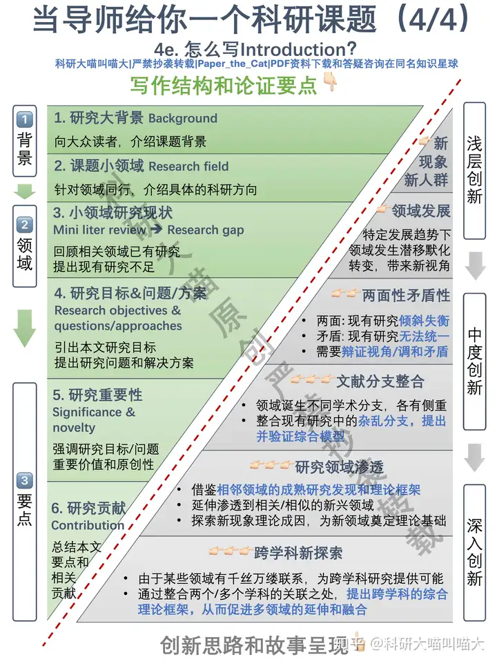
- 4f. 怎麼寫Literature review？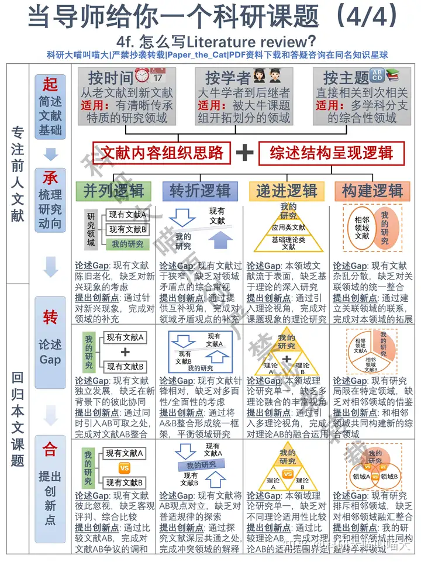
- 4g. 一篇學術論文的常見結構是怎樣的？
- 4h. 怎麼合理安排時間寫論文？
- 4i. 怎麼選擇學術期刊並投稿？