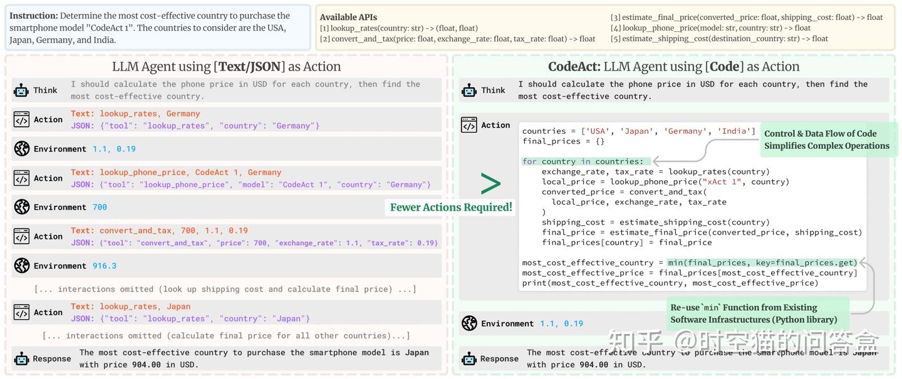

# 解读Open-source DeepResearch

## Code - Agent
在传统的人工智能代理系统中，我们通常会遇到一些限制，比如代理系统需要通过JSON格式来表达动作，这种方式虽然通用，但在处理复杂任务时可能会显得不够高效。而在这篇文章中，作者提出了一种新的改进方法，即使用所谓的“CodeAgent”。

### What's CodeAgent

In my opinion, the code agent is translate an work as to the "code base". In this process, we treat every problem as an program problem. solve this, we can have higher efficiency.

### Making the right tools
在代理系统中，选择合适的工具至关重要。工具的好坏直接影响到代理系统的性能和效率。在这篇文章中，作者提到他们为代理系统选择了两个基础工具，并且这些工具是从微软研究院的Magentic-One代理中借鉴而来的。Magentic-One是一个非常优秀的代理系统，它的工具设计非常出色，因此作者直接采用了其中的工具，并没有做太多修改。这样做是为了在保证性能的同时，尽可能降低系统的复杂性。

#### Tool 1: Webbrowser
#### Tool 2: Text Check 