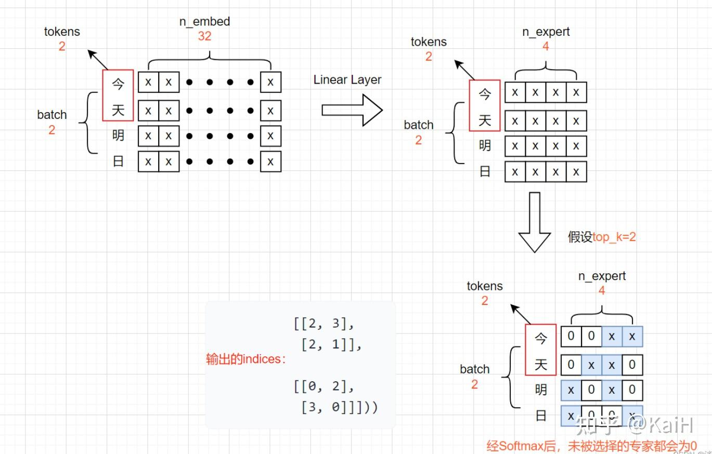

# 从零实现一个MOE（专家混合模型）

## Expert Model
```
class Expert(nn.Module):
    def __init__(self, n_embd):
        super().__init__()
        self.net = nn.Sequential(
            nn.Linear(n_embd, 4 * n_embd),
            nn.ReLU(),
            nn.Linear(4 * n_embd, n_embd),
            nn.Dropout(dropout),
        )

    def forward(self, x):
        return self.net(x)
```

## TopKRouter
We are going to design the router part of the MOE.

```
class TopkRouter(nn.Module):
    def __init__(self, n_embed, num_experts, top_k):
        super(TopkRouter, self).__init__()
        self.top_k = top_k
        self.linear =nn.Linear(n_embed, num_experts)
    
    def forward(self, mh_output):
        logits = self.linear(mh_output)    # (2,4,32) ---> (2,4,4)
        top_k_logits, indices = logits.topk(self.top_k, dim=-1)
        # (2,4,4)
        zeros = torch.full_like(logits, float('-inf'))
    
        sparse_logits = zeros.scatter(-1, indices, top_k_logits)
        router_output = F.softmax(sparse_logits, dim=-1)

        return router_output, indices
```

